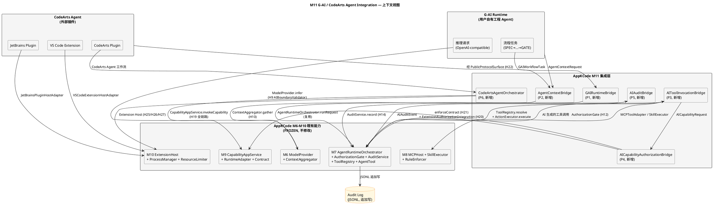
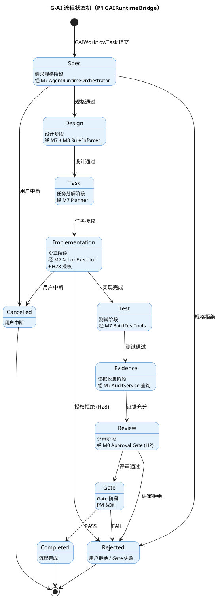
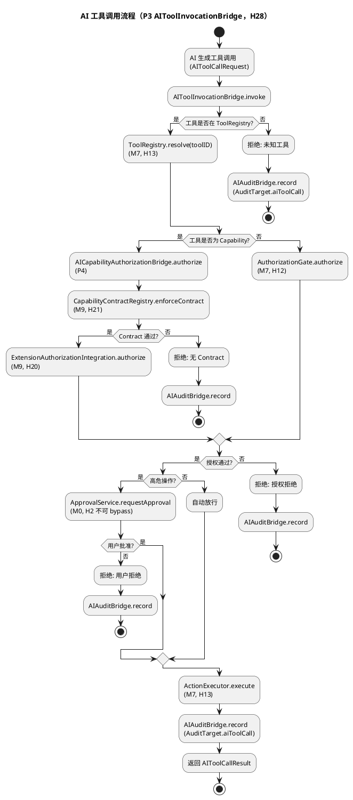
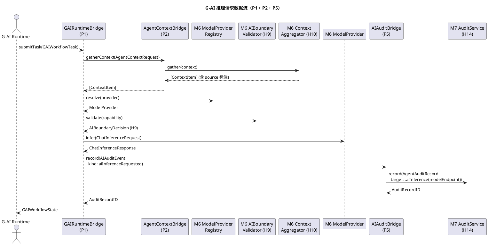
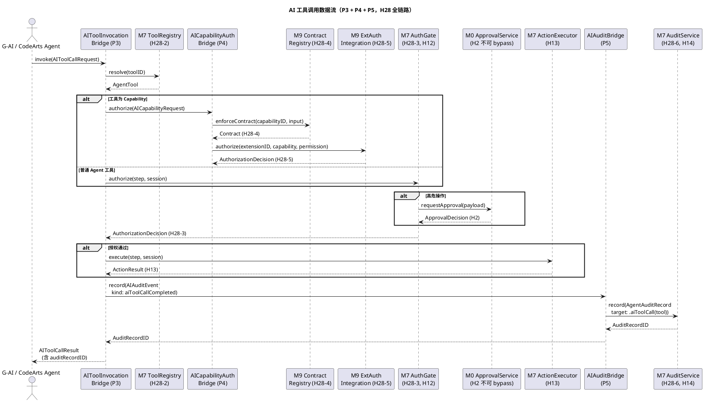
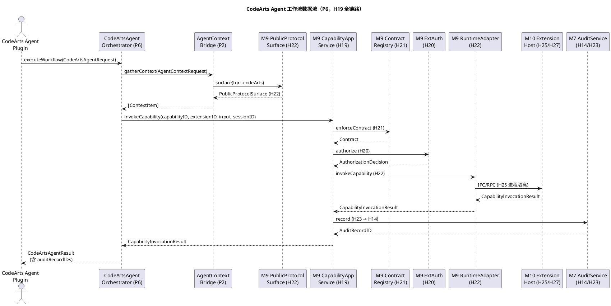
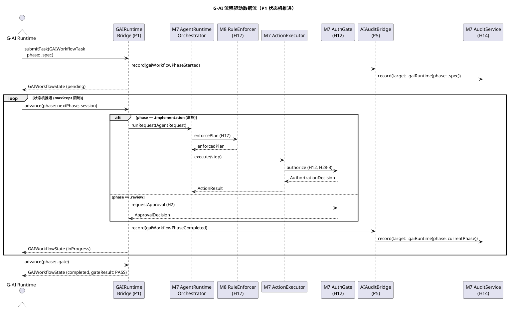

# APPK-M11 — G-AI / CodeArts Agent Integration Layer 技术设计文档

> **文档编号**: APPK-M11-DESIGN-001
> **版本**: v1.0
> **状态**: Design（待 PM Gate Review）
> **对应需求**: APPK-SPEC-001 v0.1 §5.3 (AI Agent) / §5.6 (MCP) / §5.7 (Skills/Rules) / §5.14 (G-AI Bridge)
> **对应 Scope Review**: APPK-M11-SCOPE-001 `m11_scope_review.md`
> **里程碑**: M11 — G-AI / CodeArts Agent Integration
> **前置基线**: M10 FROZEN commit `81bb91f`（1103/1103 tests PASS），M9 FROZEN `23579c2`（625/625 tests）
> **构建环境**: macOS 13.0, Swift 5.8, x86_64-apple-macos13.0
> **日期**: 2026-10-03
> **文档性质**: 技术设计（非编码任务，不产生 Swift 代码，不修改 M0-M10 任何源文件或测试文件）

---

## 0. 文档目的与范围

本文档是 M11 里程碑的**技术设计文档**，基于 `m11_scope_review.md`（P0 Scope Review）的 8 个核心问题回答、H28 AI Execution Boundary 定义、M11 Phase 划分（P0-P8），将"WHAT"（集成层需求）转化为"HOW"（可落地的架构设计）。

**本文档产出**：仅 `m11_design.md` 一份文档，包含：
1. 需求与存量功能关系分析（M11 需求 vs M6-M10 既有能力）
2. 增量设计方案（架构总图 + 接口设计 + 数据模型 + Phase 详细设计 + H28 实现方案）

**本文档不**：
- ❌ 不修改 M0-M10 任何源文件或测试文件
- ❌ 不创建任何 Swift 代码（仅定义接口签名与类型契约）
- ❌ 不修改 M10 FROZEN 基线（commit `81bb91f`）
- ❌ 不修改 M9 FROZEN 基线（commit `23579c2`）
- ❌ 不进行任务分解（属 spec-task-agent 范畴）

---

# 一、需求与存量功能关系分析

## 1.1 需求功能与存量功能对比

### 1.1.1 已实现功能（M6-M10 既有，M11 直接复用）

M11 是**集成层里程碑**，核心原则是"不重新实现任何既有能力"。以下功能已由 M6-M10 完整实现，M11 通过桥接协议复用，不修改任何既有源文件。

| 需求功能 | 存量功能 | 代码位置 | 匹配度 |
|---------|---------|---------|--------|
| G-AI 推理接口（OpenAI-compatible） | `ModelProvider` protocol + `OpenAICompatProvider` | `Sources/AppKCodeDomain/AIChat/ModelProvider.swift:4` / `OpenAICompatProvider.swift` | 100% |
| Local Model 端点（H11 默认 127.0.0.1:8080） | `LocalModelProvider` + `LocalModeResolver` | `Sources/AppKCodeDomain/AIChat/LocalModelProvider.swift` / `LocalModeResolver.swift` | 100% |
| 多 Provider 路由 | `ModelProviderRegistry` | `Sources/AppKCodeDomain/AIChat/ModelProviderRegistry.swift` | 100% |
| AI Approval Boundary（H9） | `AIBoundaryValidator` | `Sources/AppKCodeDomain/AIChat/AIBoundaryValidator.swift:4` | 100% |
| SSE 流式推理 + 重试 + 超时 | `ChatHTTPClient` | `Sources/AppKCodeInfrastructure/AIChat/ChatHTTPClient.swift` | 100% |
| Agent 上下文聚合（H10） | `ContextAggregator` + 8 个 `ContextProvider` | `Sources/AppKCodeDomain/Context/ContextAggregator.swift:4` / `Providers/` | 100% |
| Agent Runtime 编排 | `AgentRuntimeOrchestrator` | `Sources/AppKCodeApplication/AgentRuntime/AgentRuntimeOrchestrator.swift:21` | 100% |
| Agent 工具注册与解析 | `ToolRegistry` | `Sources/AppKCodeDomain/AgentRuntime/ToolRegistry.swift:11` | 100% |
| Agent 工具协议（H13 Isolation） | `AgentTool` protocol | `Sources/AppKCodeDomain/AgentRuntime/ToolProtocol.swift:18` | 100% |
| Agent 授权（H12） | `AuthorizationGate` protocol + `AuthorizationGateImpl` | `Sources/AppKCodeDomain/AgentRuntime/AuthorizationGate.swift:6` / `:12` | 100% |
| Agent 审计（H14，8 字段 + SHA-256） | `AuditService` protocol + `AuditServiceImpl` | `Sources/AppKCodeDomain/AgentRuntime/AuditService.swift:7` / `:15` | 100% |
| FileRead / FileWrite / Command / Git / BuildTest 工具 | M7 `Tools/` 目录 | `Sources/AppKCodeDomain/AgentRuntime/Tools/` | 100% |
| MCP 工具接入（H15） | `MCPHostService` + `MCPToolAdapter` | `Sources/AppKCodeDomain/MCP/MCPHostService.swift` / `MCPToolAdapter.swift` | 100% |
| Skills 执行（H16） | `SkillRegistry` + `SkillExecutor` | `Sources/AppKCodeDomain/Skills/SkillRegistry.swift` / `SkillExecutor.swift` | 100% |
| Rules 约束（H17） | `RuleEngine` + `RuleEnforcer` | `Sources/AppKCodeDomain/Rules/RuleEngine.swift` / `RuleEnforcer.swift` | 100% |
| Capability 调用（H19 全链路） | `CapabilityAppService` protocol + `CapabilityAppServiceImpl` | `Sources/AppKCodeApplication/Compatibility/CapabilityAppService.swift:7` / `:17` | 100% |
| Runtime Adapter（H22 Isolation） | `RuntimeAdapter` protocol | `Sources/AppKCodeDomain/Compatibility/RuntimeAdapterProtocol.swift:20` | 100% |
| Capability Contract（H21） | `CapabilityContractRegistry` | `Sources/AppKCodeDomain/Compatibility/CapabilityContractRegistry.swift:7` | 100% |
| Extension 授权（H20） | `ExtensionAuthorizationIntegration` | `Sources/AppKCodeDomain/Compatibility/ExtensionAuthorizationIntegration.swift` | 100% |
| Extension 审计（H23） | `ExtensionAuditIntegration` | `Sources/AppKCodeDomain/Compatibility/ExtensionAuditIntegration.swift` | 100% |
| Public Protocol Surface（H22） | `PublicProtocolSurfaceProvider` | `Sources/AppKCodeDomain/Compatibility/RuntimeAdapterProtocol.swift:31` | 100% |
| Version Negotiation（H24） | `VersionNegotiationService` | `Sources/AppKCodeDomain/Compatibility/VersionNegotiationService.swift` | 100% |
| VS Code Extension Host（H25/H26/H27） | `VSCodeExtensionHostAdapter` + `ExtensionHostProcessManager` | `Sources/AppKCodeDomain/Compatibility/VSCodeExtensionHostAdapter.swift` / `Sources/AppKCodeExtensionHost/Compatibility/` | 100% |
| JetBrains Plugin Host（H25/H26/H27） | `JetBrainsPluginHostAdapter` | `Sources/AppKCodeDomain/Compatibility/JetBrainsPluginHostAdapter.swift` | 100% |
| Approval Gate（H2 不可 bypass） | M0 `AppApprovalService` | `Sources/AppKCodeShared/` (M0 Frozen) | 100% |

**匹配度判定依据**：
- **100%**：接口契约完全匹配，M11 通过桥接协议直接调用，不修改既有实现
- 上述 25 项功能均属于此档，M11 仅新增"AI 生成动作 → 既有链路"的桥接层

### 1.1.2 需要扩展的功能（M11 仅追加，不修改语义）

| 需求功能 | 存量功能 | 差异说明 | 扩展方向 |
|---------|---------|---------|---------|
| AI 推理请求审计 | `AuditTarget` enum（M7-M9 既有 13 个 case） | 既有 `AuditTarget` 不含 AI 推理相关 case | 追加 `aiInference(modelEndpoint:)` case（不修改既有 case） |
| G-AI 流程驱动审计 | `AuditTarget` enum | 既有 `AuditTarget` 不含 G-AI 流程相关 case | 追加 `gaiRuntime(phase:)` case |
| AI 工具调用审计（区别于人类发起） | `AuditTarget` enum | 既有 `AuditTarget` 不区分 AI vs 人类发起的工具调用 | 追加 `aiToolCall(tool:)` case |
| AI 工具类别（如需要） | `ToolCategory` enum（M7 既有） | 既有 `ToolCategory` 不含 AI 桥接相关类别 | 追加 M11 新工具类别 case（如有需要，不修改既有 case） |

**扩展约束**：
- 仅扩展枚举 case，**不修改既有 case 的语义**
- **不修改** `AgentAuditRecord` 的 8 字段结构（H14 不变）
- **不修改** `AuditServiceImpl` / `AuditLogStore` 核心实现（H14/H23 不变）
- **不创建**第二套审计系统（H23 不变）
- 扩展属于 P5 阶段范围，经 PM Gate Review 授权后执行

### 1.1.3 需要新增的功能或接口（M11 桥接层，P1-P6）

M11 新增的全部是**桥接协议**，不重新实现既有能力，仅定义"AI 生成动作 → 既有链路"的接入点。

#### P1: G-AI Provider / API Contract（G-AI 流程驱动接口）

| 新增接口/类型 | 输入 | 输出 | 核心逻辑 | 依赖 |
|-------------|------|------|---------|------|
| `GAIRuntimeBridge` protocol | `GAIWorkflowTask` | `GAIWorkflowState` | SPEC→DESIGN→TASK→...→GATE 状态机桥接，经 M7 `AgentRuntimeOrchestrator` | M6 `ModelProvider` / M7 `AgentRuntimeOrchestrator` |
| `GAIWorkflowTask` struct | 流程阶段 + 用户请求 + 上下文 | — | G-AI 流程任务载体 | M6 `ChatInferenceRequest` |
| `GAIWorkflowState` enum | — | 阶段 + 证据链 + Gate 结果 | 流程状态（spec/design/task/implementation/test/evidence/review/gate） | — |
| `GAIWorkflowPhase` enum | — | — | 8 个流程阶段标识 | — |
| `GAIRuntimeBridgeImpl` class | M6/M7 依赖注入 | `GAIWorkflowState` | 桥接实现：流程任务 → AgentRuntimeOrchestrator.runRequest | M6 / M7 |

#### P2: Agent Context Bridge（G-AI / CodeArts Agent 上下文桥接）

| 新增接口/类型 | 输入 | 输出 | 核心逻辑 | 依赖 |
|-------------|------|------|---------|------|
| `AgentContextBridge` protocol | `AgentContextRequest` | `[ContextItem]` | G-AI / CodeArts Agent 请求上下文的统一桥接 | M6 `ContextAggregator` |
| `AgentContextRequest` struct | 请求来源（G-AI / CodeArts） + budget | — | 桥接请求载体 | M6 `ContextRequest` |
| `AgentContextBridgeImpl` class | M6 `ContextAggregator` 注入 | `[ContextItem]` | 桥接实现：经 `ContextAggregator.gather`（H10） | M6 |
| `CodeArtsAgentContextAdapter` class | M9 `PublicProtocolSurfaceProvider` 注入 | `[ContextItem]` | CodeArts Agent 经 `PublicProtocolSurface`（H22）注入上下文 | M9 |

#### P3: AIToolInvocationBridge（AI 工具调用 → M7 ToolRegistry）

| 新增接口/类型 | 输入 | 输出 | 核心逻辑 | 依赖 |
|-------------|------|------|---------|------|
| `AIToolInvocationBridge` protocol | `AIToolCallRequest` | `AIToolCallResult` | AI 生成的工具调用 → M7 `ToolRegistry` → `ActionExecutor` | M7 `ToolRegistry` / M8 `MCPToolAdapter` / `SkillExecutor` |
| `AIToolCallRequest` struct | toolID + arguments + source（G-AI / CodeArts） | — | AI 工具调用请求载体 | M7 `ToolID` / `ToolArguments` |
| `AIToolCallResult` struct | — | tool output + audit record ID | AI 工具调用结果（含审计记录 ID） | M7 `ToolOutput` |
| `AIToolInvocationBridgeImpl` class | M7/M8 依赖注入 | `AIToolCallResult` | 桥接实现：AI 工具调用 → `ToolRegistry.resolve` → `ActionExecutor.execute` | M7 / M8 |

#### P4: AICapabilityAuthorizationBridge（H28 授权桥接）

| 新增接口/类型 | 输入 | 输出 | 核心逻辑 | 依赖 |
|-------------|------|------|---------|------|
| `AICapabilityAuthorizationBridge` protocol | `AICapabilityRequest` | `AuthorizationDecision` | AI Capability 调用 → M9 `enforceContract`（H21）→ M7 `AuthorizationGate`（H12）或 M9 `ExtensionAuthorizationIntegration`（H20） | M7 / M9 |
| `AICapabilityRequest` struct | capabilityID + extensionID + input + source | — | AI Capability 请求载体 | M9 `CapabilityID` / `ExtensionID` |
| `AICapabilityAuthorizationBridgeImpl` class | M7/M9 依赖注入 | `AuthorizationDecision` | 桥接实现：AI Capability → `enforceContract` → `ExtensionAuthorizationIntegration` → `AuthorizationGate` | M7 / M9 |

#### P5: AI Audit Bridge（H28 审计桥接）

| 新增接口/类型 | 输入 | 输出 | 核心逻辑 | 依赖 |
|-------------|------|------|---------|------|
| `AIAuditBridge` protocol | `AIAuditEvent` | `AuditRecordID` | AI 推理/工具调用/流程驱动审计 → M7 `AuditService.record`（H14） | M7 `AuditService` |
| `AIAuditEvent` struct | event kind + target + detail | — | AI 审计事件载体 | M7 `AgentAuditRecord` |
| `AIAuditBridgeImpl` class | M7 `AuditService` 注入 | `AuditRecordID` | 桥接实现：AI 事件 → `AgentAuditRecord` → `AuditService.record` | M7 |
| `AuditTarget` 扩展 | — | — | 追加 `aiInference` / `gaiRuntime` / `aiToolCall` case | M7 `AuditTarget`（仅追加 case） |

#### P6: CodeArts Agent Integration（CodeArts Agent 工作流集成）

| 新增接口/类型 | 输入 | 输出 | 核心逻辑 | 依赖 |
|-------------|------|------|---------|------|
| `CodeArtsAgentOrchestrator` class | M9 `CapabilityAppService` + M10 Adapter 注入 | `CodeArtsAgentResult` | CodeArts Agent 工作流编排（经 M9 全链路） | M9 / M10 |
| `CodeArtsAgentResult` struct | — | 阶段结果 + 审计记录 ID | CodeArts Agent 执行结果 | M9 |
| `CodeArtsAdapterDeepeningPolicy` enum | — | — | CodeArts Adapter 深化策略（P6 评估决定） | M9 `CodeArtsAdapter` |

#### P7-P8: 端到端集成与验收（不新增接口，仅集成测试与回归）

| 新增内容 | 范围 | 依赖 |
|---------|------|------|
| 端到端集成测试 | G-AI → Agent → Tool → Contract → Auth → Exec → Audit 全链路 | P1-P6 全部 |
| CodeArts Agent 端到端测试 | CodeArts Agent → Adapter → Contract → Auth → Exec → Audit 全链路 | P6 |
| 全量回归测试 | M0-M10 既有 1103 tests + M11 新增 tests | M0-M10 + P1-P6 |
| `m11_exit_report.md` | Exit Report | 全部 |

## 1.2 存量功能详细分析

### 1.2.1 M6 ModelProvider 接口契约

**接口契约**（`Sources/AppKCodeDomain/AIChat/ModelProvider.swift:4`）：
- 入参：`ChatInferenceRequest`（含 model / messages / stream / temperature 等）
- 出参：`ChatInferenceResponse`（非流式）或 `AsyncThrowingStream<StreamingChunk, Error>`（流式）
- 异常：网络错误 / 超时 / 鉴权失败 / 端点不可达
- 副作用：HTTP 请求到外部端点（Local Mode 默认 127.0.0.1:8080，H3/H11）

**业务规则**：
- `ModelProviderRegistry` 支持多 Provider 共存，按 `ModelProviderID` 路由
- `LocalModelProvider` 在 Local Mode 下拒绝非 127.0.0.1 端点（H11）
- `AIBoundaryValidator` 校验 AI 能力边界（H9），允许集与禁止集互斥

**约束**：
- 线程安全：`Sendable`
- 超时：`ChatHTTPClient` 指数退避重试 3 次
- M11 不修改此接口，仅通过 `GAIRuntimeBridge` 调用

### 1.2.2 M7 AgentRuntimeOrchestrator 接口契约

**接口契约**（`Sources/AppKCodeApplication/AgentRuntimeOrchestrator.swift:21`）：
- 入参：`AgentRequest`（含 prompt）+ `AgentSessionID`
- 出参：`AgentResponse`
- 异常：Plan 生成失败 / 工具执行失败 / 授权拒绝 / 审计失败
- 副作用：工具执行（经 AuthorizationGate + AuditService）

**业务规则**：
1. `sessionManager.snapshot(session)` → 获取会话快照
2. `contextAggregator.gather(context)` → 聚合上下文（H10）
3. `planner.generatePlan(...)` → 生成 `ActionPlan`
4. `ruleEnforcer.enforcePlan(plan, scope: .session)` → 应用 Rules 约束（H17）
5. `while plan.nextExecutableStep()`：循环执行
   - `actionExecutor.execute(step, session)` → 执行（含 AuthorizationGate H12 + AuditService H14）
6. 返回 `AgentResponse`

**扩展点**：
- `ruleEnforcer: RuleEnforcer?`（可选，M8 注入）
- `capabilityAppService: CapabilityAppService?`（可选，M9 注入）
- M11 通过 `GAIRuntimeBridge` 调用 `runRequest`，不修改 Orchestrator

**约束**：
- 线程安全：`@unchecked Sendable`
- 无限循环防护：Plan 必须有终止条件（`nextExecutableStep()` 返回 nil）
- M11 不修改此实现

### 1.2.3 M7 AuthorizationGate 接口契约

**接口契约**（`Sources/AppKCodeDomain/AgentRuntime/AuthorizationGate.swift:6`）：
- 入参：`ActionStep` + `AgentSessionID`
- 出参：`AuthorizationDecision`（allowed / rejected / timeout）
- 异常：`ApprovalService` 请求失败
- 副作用：高危操作触发 Approval Gate（H2 不可 bypass）

**业务规则**（`AuthorizationGateImpl:12`）：
1. `toolRegistry.schema(step.toolID)` → 获取工具 schema
2. `switch schema.permission`：
   - `readOnly` / `low` → 自动放行并记录
   - `high` → `requestHighRiskApproval` → `approvalService.requestApproval`（H2）
3. 返回 `AuthorizationDecision`

**关键不可绕过点**：
- H2：`ApprovalService` 无 bypass 配置项（M0 Frozen）
- H12：`high` 强制审批
- M11 不修改此实现，AI 生成的高危操作经此同一链路（H28-3）

### 1.2.4 M7 AuditService 接口契约

**接口契约**（`Sources/AppKCodeDomain/AgentRuntime/AuditService.swift:7`）：
- 入参：`AgentAuditRecord`（8 字段 + SHA-256）
- 出参：void（记录成功）/ Error（记录失败）
- 异常：`AuditLogStore` 写入失败
- 副作用：JSONL 追加写（不可篡改）

**业务规则**（`AuditServiceImpl:15`）：
- `record(entry)` → `logStore.append(entry)`（追加写）
- `query(filter)` → `logStore.query(filter)`
- `verifyIntegrity(session)` → 校验 SHA-256

**关键不变量**：
- H14：8 字段强制 + SHA-256 完整性
- H23：单一审计入口，无第二套审计系统
- M11 仅扩展 `AuditTarget` 枚举 case，不修改此实现

### 1.2.5 M9 CapabilityAppService 接口契约

**接口契约**（`Sources/AppKCodeApplication/Compatibility/CapabilityAppService.swift:7`）：
- 入参：`CapabilityID` + `ExtensionID` + `AnyCodableValue` + `AgentSessionID`
- 出参：`CapabilityInvocationResult`（success / denied / degraded）
- 异常：Contract 校验失败 / 授权拒绝 / Adapter 调用失败
- 副作用：经 Adapter 执行 Capability（H22）

**业务规则**（`CapabilityAppServiceImpl:17`）：
1. `contractRegistry.enforceContract(id, input)` → H21 Contract 强制（无 Contract 拒绝）
2. `authIntegration.authorize(...)` → H20 授权（默认拒绝）
3. `auditIntegration.recordExtensionEvent(...)` → H23 审计
4. `adapter.invokeCapability(id, input, sessionID)` → H22 经 Adapter 执行

**关键不可绕过点**：
- H21：`enforceContract` 强制，无 Contract 不执行
- H20：默认拒绝 + 高危二次审批
- H22：经 Adapter，不直接执行
- M11 不修改此实现，AI 生成的 Capability 调用经此同一链路（H28-4/H28-5）

### 1.2.6 M9 RuntimeAdapter 接口契约

**接口契约**（`Sources/AppKCodeDomain/Compatibility/RuntimeAdapterProtocol.swift:20`）：
- 入参：`CapabilityID` + `AnyCodableValue` + `AgentSessionID`
- 出参：`CapabilityInvocationResult`
- 异常：Adapter 调用失败 / 进程崩溃
- 副作用：IPC / RPC 到外部进程（H22 Isolation）

**业务规则**：
- `instantiate(context)` → 创建 Adapter 实例
- `invokeCapability(id, input, sessionID)` → 经 IPC/RPC 调用外部进程
- `interceptUnhandledAPI(call)` → 未声明 API 降级（H26）
- `dispose()` → 销毁

**关键不可绕过点**：
- H22：`PublicProtocolSurface` + `BoundaryService`，IPC JSON-RPC，无直接内存访问
- M11 复用 M10 `VSCodeExtensionHostAdapter` / `JetBrainsPluginHostAdapter`，不重新实现

### 1.2.7 既有硬约束矩阵（H1-H27，M11 不变）

| 硬约束 | 内容 | 实现位置 | M11 关系 |
|--------|------|---------|---------|
| H1 | x86_64 Architecture Only | `arch-check.sh` + 构建目标 | M11 保持不变 |
| H2 | No Bypass Path（Approval Gate） | M0 `ApprovalService` | M11 不修改，AI 高危经此 |
| H3 | Local Mode Default | M6 `LocalModeResolver` | M11 不修改 |
| H7 | 危险命令拦截 | M7 `CommandExecuteTool` | M11 不修改 |
| H9 | AI Approval Boundary | M6 `AIBoundaryValidator` | M11 复用，H28-1 |
| H10 | Context Isolation | M6 `ContextAggregator` | M11 复用，P2 桥接 |
| H11 | Local Mode 端点 | M6 `LocalModelClient` | M11 不修改 |
| H12 | Agent Authorization | M7 `AuthorizationGateImpl` | M11 复用，H28-3 |
| H13 | Tool Isolation | M7 `AgentTool` protocol | M11 复用，H28-2 |
| H14 | Agent Audit | M7 `AuditServiceImpl` | M11 复用，H28-6 |
| H15 | MCP Isolation | M8 `MCPToolInvocation` | M11 复用 |
| H16 | Skill Isolation | M8 `SkillExecutionPolicy` | M11 复用 |
| H17 | Rules 优先级 | M8 `RuleEnforcer` | M11 复用，AI Plan 同样适用 |
| H18 | MCP/Skill Audit | M7 `AuditService`（AuditTarget.mcp/skill） | M11 复用 |
| H19 | Compatibility Isolation | M9 全链路 | M11 复用，P6 |
| H20 | Extension Authorization | M9 `ExtensionAuthorizationIntegration` | M11 复用，H28-5 |
| H21 | Capability Contract | M9 `CapabilityContractRegistry` | M11 复用，H28-4 |
| H22 | Adapter Isolation | M9 `PublicProtocolSurface` | M11 复用，P2/P6 |
| H23 | Compatibility Audit | M9 `ExtensionAuditIntegration` → M7 | M11 复用，H28-6/H28-10 |
| H24 | Version Negotiation | M9 `VersionNegotiationService` | M11 复用 |
| H25 | Process Isolation | M10 `ExtensionHostProcessManager` | M11 复用 |
| H26 | API Surface Boundary | M10 `VSCodeAPISurfaceRegistry` / `JetBrainsOpenAPISurfaceRegistry` | M11 复用 |
| H27 | Resource Limit | M10 `ExtensionResourceLimiter` | M11 复用 |

---
# 二、增量设计方案

## 2.1 实现模型

### 2.1.1 上下文视图

M11 集成层的上下文视图展示 G-AI Runtime / CodeArts Agent 与 AppKCode 既有能力的交互关系。



**通信协议与调用频率**：

| 交互 | 协议 | 频率 | 硬约束 |
|------|------|------|--------|
| G-AI → M6 ModelProvider | OpenAI-compatible HTTP/SSE | 每次推理请求 | H3/H9/H11 |
| G-AI → GAIRuntimeBridge | Swift 函数调用（进程内） | 每次流程任务 | H28 |
| CodeArts Agent → PublicProtocolSurface | IPC JSON-RPC | 每次 Capability 调用 | H22 |
| M7 → AuditService | Swift 函数调用（进程内） | 每次工具执行 | H14 |
| M10 Extension Host ↔ 外部进程 | stdio/HTTP IPC | 持续 | H25/H26/H27 |

### 2.1.2 服务/组件总体架构

M11 集成层的总体架构展示模块内部的组成结构，核心是**桥接层**（不重新实现既有能力）。

```plantuml
@startuml M11_ComponentArchitecture
title M11 集成层 — 组件架构

skinparam component {
    BackgroundColor #E8F5E9
    BorderColor #2E7D32
}
skinparam package {
    BackgroundColor #F3E5F5
    BorderColor #6A1B9A
}

package "AppKCode M11 集成层（新增）" as M11 {
    component "GAIRuntimeBridge\n(P1)" as P1 <<protocol>>
    component "GAIRuntimeBridgeImpl\n(P1)" as P1Impl <<impl>>
    component "AgentContextBridge\n(P2)" as P2 <<protocol>>
    component "AgentContextBridgeImpl\n(P2)" as P2Impl <<impl>>
    component "CodeArtsAgentContextAdapter\n(P2)" as P2Adapter <<impl>>
    component "AIToolInvocationBridge\n(P3)" as P3 <<protocol>>
    component "AIToolInvocationBridgeImpl\n(P3)" as P3Impl <<impl>>
    component "AICapabilityAuthorizationBridge\n(P4)" as P4 <<protocol>>
    component "AICapabilityAuthorizationBridgeImpl\n(P4)" as P4Impl <<impl>>
    component "AIAuditBridge\n(P5)" as P5 <<protocol>>
    component "AIAuditBridgeImpl\n(P5)" as P5Impl <<impl>>
    component "CodeArtsAgentOrchestrator\n(P6)" as P6 <<impl>>
    component "GAIIntegrationOrchestrator\n(P7, 端到端编排)" as P7Orch <<impl>>
}

package "AppKCode M6 AIChat（FROZEN）" as M6Pkg {
    component "ModelProvider" as M6MP <<protocol>>
    component "ModelProviderRegistry" as M6Reg
    component "AIBoundaryValidator" as M6BV
    component "ContextAggregator" as M6Ctx
}

package "AppKCode M7 AgentRuntime（FROZEN）" as M7Pkg {
    component "AgentRuntimeOrchestrator" as M7Orch
    component "ToolRegistry" as M7TR
    component "AuthorizationGate" as M7AG <<protocol>>
    component "AuditService" as M7AS <<protocol>>
    component "ActionExecutor" as M7AE
}

package "AppKCode M8 MCP/Skills/Rules（FROZEN）" as M8Pkg {
    component "MCPToolAdapter" as M8MCP
    component "SkillExecutor" as M8Skill
    component "RuleEnforcer" as M8Rule
}

package "AppKCode M9 Compatibility（FROZEN）" as M9Pkg {
    component "CapabilityAppService" as M9Cap <<protocol>>
    component "CapabilityContractRegistry" as M9Contract
    component "ExtensionAuthorizationIntegration" as M9Auth
    component "RuntimeAdapter" as M9Adapter <<protocol>>
    component "PublicProtocolSurfaceProvider" as M9Surface
}

package "AppKCode M10 ExtensionHost（FROZEN）" as M10Pkg {
    component "ExtensionHostProcessManager" as M10Proc
    component "VSCodeExtensionHostAdapter" as M10VS
    component "JetBrainsPluginHostAdapter" as M10JB
}

' M11 内部依赖
P1Impl ..> P1 : implements
P1Impl ..> M6MP : "推理请求"
P1Impl ..> M7Orch : "流程驱动"
P1Impl ..> P5 : "审计"

P2Impl ..> P2 : implements
P2Impl ..> M6Ctx : "上下文聚合"
P2Adapter ..> P2 : implements
P2Adapter ..> M9Surface : "PublicProtocolSurface (H22)"

P3Impl ..> P3 : implements
P3Impl ..> M7TR : "工具解析"
P3Impl ..> M7AE : "工具执行"
P3Impl ..> M8MCP : "MCP 工具"
P3Impl ..> M8Skill : "Skill 执行"
P3Impl ..> P4 : "授权"
P3Impl ..> P5 : "审计"

P4Impl ..> P4 : implements
P4Impl ..> M9Contract : "enforceContract (H21)"
P4Impl ..> M9Auth : "Extension Auth (H20)"
P4Impl ..> M7AG : "AuthorizationGate (H12)"

P5Impl ..> P5 : implements
P5Impl ..> M7AS : "AuditService.record (H14)"

P6 ..> M9Cap : "Capability 调用 (H19)"
P6 ..> M10Proc : "进程隔离 (H25)"
P6 ..> M9Adapter : "RuntimeAdapter (H22)"

P7Orch ..> P1 : "G-AI 桥接"
P7Orch ..> P2 : "上下文桥接"
P7Orch ..> P3 : "工具调用桥接"
P7Orch ..> P6 : "CodeArts 编排"

@enduml
```



**模块职责说明**：

| 模块 | 职责 | Phase | 新增文件数 |
|------|------|-------|-----------|
| `GAIRuntimeBridge` | G-AI 流程驱动桥接（SPEC→...→GATE） | P1 | 5（protocol + impl + 3 类型） |
| `AgentContextBridge` | G-AI / CodeArts Agent 上下文桥接 | P2 | 4（protocol + 2 impl + 1 类型） |
| `AIToolInvocationBridge` | AI 工具调用 → M7 ToolRegistry 桥接 | P3 | 4（protocol + impl + 2 类型） |
| `AICapabilityAuthorizationBridge` | H28 授权桥接 | P4 | 3（protocol + impl + 1 类型） |
| `AIAuditBridge` | H28 审计桥接 + AuditTarget 扩展 | P5 | 4（protocol + impl + 1 类型 + 枚举扩展） |
| `CodeArtsAgentOrchestrator` | CodeArts Agent 工作流编排 | P6 | 3（impl + 2 类型） |
| `GAIIntegrationOrchestrator` | 端到端集成编排 | P7 | 1（impl） |

**配置项及取值策略**：

| 配置项 | 取值 | 策略 |
|--------|------|------|
| G-AI 流程最大步数 | 有限值（如 100） | 防止无限循环（§15.1 禁止项） |
| AI 工具调用超时 | 复用 M7 ActionExecutor 超时 | 不引入新超时配置 |
| CodeArts Agent 深化策略 | `evaluateOnly`（P6 评估）/ `deepen`（如授权） | P6 Gate Review 决定 |
| AuditTarget 扩展 | 追加 3 个 case | 不修改既有 case |

### 2.1.3 实现设计文档

#### 2.1.3.1 G-AI 流程状态机设计

G-AI Runtime 的流程驱动遵循 SPEC→DESIGN→TASK→IMPLEMENTATION→TEST→EVIDENCE→REVIEW→GATE 状态机。



**状态转换触发条件与处理策略**：

| 转换 | 触发条件 | 处理策略 | 硬约束 |
|------|---------|---------|--------|
| Spec → Design | 规格通过 | `GAIRuntimeBridge.advance(.design)` | H28 |
| Design → Task | 设计通过 | `RuleEnforcer.enforcePlan`（H17） | H17 |
| Task → Implementation | 任务授权 | `AuthorizationGate.authorize`（H12） | H28-3 |
| Implementation → Test | 实现完成 | `ActionExecutor.execute`（H13） | H28-2 |
| Test → Evidence | 测试通过 | `AuditService.query`（H14） | H28-6 |
| Evidence → Review | 证据充分 | `ApprovalService.requestApproval`（H2） | H2 |
| Review → Gate | 评审通过 | PM Gate Review | — |
| Gate → Completed | PASS | 流程完成 | — |
| Gate → Rejected | FAIL | 流程终止 | — |
| 任意 → Cancelled | 用户中断 | `AgentSessionManager.cancel` | — |

**关键约束**：
- 每次状态转换经 `AIAuditBridge` 审计（H28-6）
- 高危转换（Implementation）经 `AuthorizationGate` 强制审批（H28-3）
- 无限循环防护：最大步数限制 + 用户可中断（§15.1）

#### 2.1.3.2 AI 工具调用流程设计



**关键不可绕过点**（H28 验收条件对应）：
- H28-2：工具调用经 M7 `ToolRegistry`（`ToolRegistry.resolve`）
- H28-3：高危操作经 M7 `AuthorizationGate`（H12）强制审批
- H28-4：Capability 调用经 M9 `enforceContract`（H21）
- H28-5：Extension 调用经 M9 `ExtensionAuthorizationIntegration`（H20）
- H28-6：所有动作经 M7 `AuditService`（H14）审计
- H28-7/H28-8/H28-9：不存在 AI → Shell / Git / File 直接执行路径（经 `ToolRegistry` + `ActionExecutor`）

---

## 2.2 接口设计

### 2.2.1 总体设计

M11 新增接口分为 5 类（P1-P5），均为**桥接协议**，不替代既有接口。

| 接口分类 | 接口名 | Phase | 稳定性等级 | 复用的既有接口 |
|---------|--------|-------|-----------|--------------|
| G-AI 流程驱动 | `GAIRuntimeBridge` | P1 | 稳定 | M6 `ModelProvider` / M7 `AgentRuntimeOrchestrator` |
| 上下文桥接 | `AgentContextBridge` | P2 | 稳定 | M6 `ContextAggregator` / M9 `PublicProtocolSurfaceProvider` |
| 工具调用桥接 | `AIToolInvocationBridge` | P3 | 稳定 | M7 `ToolRegistry` / `ActionExecutor` / M8 `MCPToolAdapter` / `SkillExecutor` |
| 授权桥接 | `AICapabilityAuthorizationBridge` | P4 | 稳定 | M7 `AuthorizationGate` / M9 `CapabilityContractRegistry` / `ExtensionAuthorizationIntegration` |
| 审计桥接 | `AIAuditBridge` | P5 | 稳定 | M7 `AuditService` |
| CodeArts 编排 | `CodeArtsAgentOrchestrator` | P6 | 实验 | M9 `CapabilityAppService` / M10 Adapter |
| 端到端编排 | `GAIIntegrationOrchestrator` | P7 | 实验 | P1-P6 全部 |

**接口继承体系**：M11 新增接口不继承既有接口，仅通过组合（dependency injection）复用既有能力。

**接口变更策略**：
- M11 新增接口在 M11 生命周期内稳定（不 breaking change）
- `AuditTarget` 枚举扩展仅追加 case，不修改既有 case（向后兼容）
- M11 不修改任何既有接口签名

### 2.2.2 接口清单

#### 2.2.2.1 GAIRuntimeBridge（P1）

**接口签名**：
```swift
// P1: G-AI 流程驱动桥接
public protocol GAIRuntimeBridge: Sendable {
    func submitTask(_ task: GAIWorkflowTask) async throws -> GAIWorkflowState
    func advance(phase: GAIWorkflowPhase, session: AgentSessionID) async throws -> GAIWorkflowState
    func currentState(session: AgentSessionID) async throws -> GAIWorkflowState
    func cancel(session: AgentSessionID) async throws
}

// G-AI 流程阶段
public enum GAIWorkflowPhase: String, Sendable, Codable, Equatable {
    case spec, design, task, implementation, test, evidence, review, gate
}

// G-AI 流程任务
public struct GAIWorkflowTask: Sendable, Codable, Equatable {
    public let id: GAIWorkflowTaskID
    public let phase: GAIWorkflowPhase
    public let userRequest: String
    public let contextRequest: AgentContextRequest
    public let maxSteps: Int  // 防止无限循环
}

// G-AI 流程状态
public struct GAIWorkflowState: Sendable, Codable, Equatable {
    public let taskID: GAIWorkflowTaskID
    public let currentPhase: GAIWorkflowPhase
    public let status: GAIWorkflowStatus
    public let evidenceChain: [GAIWorkflowEvidence]
    public let gateResult: GateResult?
}

public enum GAIWorkflowStatus: String, Sendable, Codable, Equatable {
    case pending, inProgress, awaitingApproval, completed, rejected, cancelled
}
```

**业务说明**：G-AI Runtime 流程驱动桥接，将 SPEC→DESIGN→TASK→IMPLEMENTATION→TEST→EVIDENCE→REVIEW→GATE 状态机桥接到 M7 `AgentRuntimeOrchestrator`。

**前置条件**：
- M6 `ModelProvider` 已配置（推理接口可用）
- M7 `AgentRuntimeOrchestrator` 已初始化
- `maxSteps` 为有限值（防止无限循环）

**后置条件**：
- 每次状态转换经 `AIAuditBridge` 审计（H28-6）
- 高危阶段（implementation）经 `AuthorizationGate` 强制审批（H28-3）

**异常映射**：
- `GAIError.unknownPhase` → 业务错误码 `M11-P1-001`
- `GAIError.maxStepsExceeded` → 业务错误码 `M11-P1-002`（防止无限循环）
- `GAIError.authorizationDenied` → 业务错误码 `M11-P1-003`（H28-3）

**调用示例**：
```swift
let bridge = GAIRuntimeBridgeImpl(
    modelProvider: modelProviderRegistry,
    orchestrator: agentRuntimeOrchestrator,
    auditBridge: aiAuditBridge
)
let task = GAIWorkflowTask(
    id: GAIWorkflowTaskID(),
    phase: .spec,
    userRequest: "实现用户登录功能",
    contextRequest: AgentContextRequest(source: .gaiRuntime, budget: defaultBudget),
    maxSteps: 100
)
let state = try await bridge.submitTask(task)
```

#### 2.2.2.2 AgentContextBridge（P2）

**接口签名**：
```swift
// P2: Agent 上下文桥接
public protocol AgentContextBridge: Sendable {
    func gatherContext(_ request: AgentContextRequest) async throws -> [ContextItem]
}

// 桥接请求
public struct AgentContextRequest: Sendable, Codable, Equatable {
    public let source: AgentContextSource
    public let projectRoot: URL
    public let budget: ContextBudget
}

public enum AgentContextSource: String, Sendable, Codable, Equatable {
    case gaiRuntime, codeArtsAgent, appkcodeAgent
}
```

**业务说明**：G-AI / CodeArts Agent 请求上下文的统一桥接，经 M6 `ContextAggregator`（H10）。CodeArts Agent 经 M9 `PublicProtocolSurface`（H22）注入，不直接访问宿主内部。

**前置条件**：
- M6 `ContextAggregator` 已初始化（8 个 `ContextProvider` 已注册）
- CodeArts Agent 经 `PublicProtocolSurfaceProvider`（H22）

**后置条件**：
- 每个 `ContextItem` 含 `source` 标注（H10）
- `ContextBudget` 截断生效（防止上下文爆炸）

**异常映射**：
- `ContextError.budgetExceeded` → `M11-P2-001`
- `ContextError.surfaceViolation` → `M11-P2-002`（H22 违反）

#### 2.2.2.3 AIToolInvocationBridge（P3）

**接口签名**：
```swift
// P3: AI 工具调用桥接
public protocol AIToolInvocationBridge: Sendable {
    func invoke(_ request: AIToolCallRequest) async throws -> AIToolCallResult
}

// AI 工具调用请求
public struct AIToolCallRequest: Sendable, Codable, Equatable {
    public let toolID: ToolID
    public let arguments: ToolArguments
    public let source: AgentContextSource  // 区分 AI vs 人类发起
    public let sessionID: AgentSessionID
}

// AI 工具调用结果
public struct AIToolCallResult: Sendable, Codable, Equatable {
    public let toolOutput: ToolOutput
    public let auditRecordID: AuditRecordID
    public let authorizationDecision: AuthorizationDecision
}
```

**业务说明**：AI 生成的工具调用 → M7 `ToolRegistry.resolve` → `ActionExecutor.execute`，经 H28 授权与审计链路。

**前置条件**：
- 工具已注册到 M7 `ToolRegistry`（`ToolRegistry.resolve(toolID)` 返回非 nil）
- `source` 为 `.gaiRuntime` 或 `.codeArtsAgent`（区分 AI vs 人类发起）

**后置条件**：
- 工具调用经 `AICapabilityAuthorizationBridge`（P4）授权
- 工具调用经 `AIAuditBridge`（P5）审计，`AuditTarget.aiToolCall`
- 返回 `AIToolCallResult` 含 `auditRecordID`（可追溯）

**异常映射**：
- `AIToolError.unknownTool` → `M11-P3-001`（H28-2）
- `AIToolError.authorizationDenied` → `M11-P3-002`（H28-3）
- `AIToolError.executionFailed` → `M11-P3-003`

#### 2.2.2.4 AICapabilityAuthorizationBridge（P4）

**接口签名**：
```swift
// P4: AI Capability 授权桥接
public protocol AICapabilityAuthorizationBridge: Sendable {
    func authorize(_ request: AICapabilityRequest) async throws -> AuthorizationDecision
}

// AI Capability 请求
public struct AICapabilityRequest: Sendable, Codable, Equatable {
    public let capabilityID: CapabilityID
    public let extensionID: ExtensionID
    public let input: AnyCodableValue
    public let source: AgentContextSource
    public let sessionID: AgentSessionID
}
```

**业务说明**：AI Capability 调用 → M9 `enforceContract`（H21）→ M9 `ExtensionAuthorizationIntegration`（H20）→ M7 `AuthorizationGate`（H12）。

**前置条件**：
- Capability 已注册到 M9 `CapabilityContractRegistry`
- Extension 已经 M9 `VersionNegotiationService` 协商（H24）

**后置条件**：
- 无 Contract 拒绝执行（H21，H28-4）
- 默认拒绝 + 高危二次审批（H20，H28-5）
- 授权决策经 `AIAuditBridge` 审计（H28-6）

**异常映射**：
- `AICapabilityError.noContract` → `M11-P4-001`（H28-4）
- `AICapabilityError.extensionDenied` → `M11-P4-002`（H28-5）
- `AICapabilityError.highRiskRejected` → `M11-P4-003`（H28-3）

#### 2.2.2.5 AIAuditBridge（P5）

**接口签名**：
```swift
// P5: AI 审计桥接
public protocol AIAuditBridge: Sendable {
    func record(_ event: AIAuditEvent) async throws -> AuditRecordID
}

// AI 审计事件
public struct AIAuditEvent: Sendable, Codable, Equatable {
    public let kind: AIAuditEventKind
    public let target: AuditTarget  // 含 M11 扩展 case
    public let sessionID: AgentSessionID
    public let detail: AnyCodableValue
    public let timestamp: ISO8601Timestamp
}

public enum AIAuditEventKind: String, Sendable, Codable, Equatable {
    case aiInferenceRequested, aiInferenceCompleted, aiInferenceFailed
    case gaiWorkflowPhaseStarted, gaiWorkflowPhaseCompleted, gaiWorkflowPhaseFailed
    case aiToolCallRequested, aiToolCallCompleted, aiToolCallFailed
    case aiAuthorizationRequested, aiAuthorizationDecision
}

// AuditTarget 扩展（仅追加 case，不修改既有）
// 既有 case: filePath / command / gitRemote / buildTarget / testTarget /
//           mcpServer / skillInvocation / ruleEvaluation / extension_ /
//           adapter / capability / contractNegotiation / permissionDecision / none
// M11 新增 case:
//   aiInference(modelEndpoint: String)
//   gaiRuntime(phase: GAIWorkflowPhase)
//   aiToolCall(tool: ToolID)
```

**业务说明**：AI 推理 / 工具调用 / 流程驱动审计 → M7 `AuditService.record`（H14），单一审计入口，无第二套审计系统（H23，H28-10）。

**前置条件**：
- M7 `AuditService` 已初始化
- `AuditTarget` 已扩展（P5 阶段追加 case）

**后置条件**：
- 审计记录含 8 字段 + SHA-256（H14 不变）
- JSONL 追加写（不可篡改）
- 单一审计入口（H23 不变）

**异常映射**：
- `AIAuditError.recordFailed` → `M11-P5-001`
- `AIAuditError.integrityViolation` → `M11-P5-002`（SHA-256 校验失败）

#### 2.2.2.6 CodeArtsAgentOrchestrator（P6）

**接口签名**：
```swift
// P6: CodeArts Agent 工作流编排
public final class CodeArtsAgentOrchestrator: @unchecked Sendable {
    public init(
        capabilityAppService: CapabilityAppService,
        contextBridge: AgentContextBridge,
        auditBridge: AIAuditBridge,
        deepeningPolicy: CodeArtsAdapterDeepeningPolicy
    )
    func executeWorkflow(_ request: CodeArtsAgentRequest) async throws -> CodeArtsAgentResult
}

public enum CodeArtsAdapterDeepeningPolicy: String, Sendable, Codable, Equatable {
    case evaluateOnly  // P6 仅评估，不深化
    case deepen       // P6 Gate Review 授权后深化
}

public struct CodeArtsAgentRequest: Sendable, Codable, Equatable {
    public let extensionID: ExtensionID
    public let workflow: String
    public let contextRequest: AgentContextRequest
    public let sessionID: AgentSessionID
}

public struct CodeArtsAgentResult: Sendable, Codable, Equatable {
    public let phaseResults: [CodeArtsAgentPhaseResult]
    public let auditRecordIDs: [AuditRecordID]
    public let status: CodeArtsAgentStatus
}
```

**业务说明**：CodeArts Agent 工作流编排，经 M9 `CapabilityAppService.invokeCapability`（H19 全链路），复用 M10 `VSCodeExtensionHostAdapter` / `JetBrainsPluginHostAdapter`。

**前置条件**：
- M9 `CapabilityAppService` 已初始化
- M10 Extension Host 已启动（H25）
- Extension 已经 M9 `VersionNegotiationService` 协商（H24）

**后置条件**：
- 所有 Capability 调用经 H19 全链路（Contract → Auth → Exec → Audit）
- 进程隔离（H25）+ 资源限制（H27）生效
- 不宣称"所有 CodeArts 插件完全兼容"

**异常映射**：
- `CodeArtsAgentError.incompatibleExtension` → `M11-P6-001`（H24）
- `CodeArtsAgentError.processCrashed` → `M11-P6-002`（H25）
- `CodeArtsAgentError.resourceLimitExceeded` → `M11-P6-003`（H27）

#### 2.2.2.7 GAIIntegrationOrchestrator（P7，端到端编排）

**接口签名**：
```swift
// P7: 端到端集成编排
public final class GAIIntegrationOrchestrator: @unchecked Sendable {
    public init(
        gaiBridge: GAIRuntimeBridge,
        contextBridge: AgentContextBridge,
        toolBridge: AIToolInvocationBridge,
        authBridge: AICapabilityAuthorizationBridge,
        auditBridge: AIAuditBridge,
        codeArtsOrchestrator: CodeArtsAgentOrchestrator
    )
    func runGAIIntegration(_ task: GAIWorkflowTask) async throws -> GAIIntegrationResult
    func runCodeArtsIntegration(_ request: CodeArtsAgentRequest) async throws -> CodeArtsAgentResult
}
```

**业务说明**：端到端集成编排，串联 P1-P6 全部桥接，验证 H28 全链路。

**前置条件**：P1-P6 全部桥接已初始化并通过 Phase Exit Gate。

**后置条件**：端到端集成测试 PASS，H28-1 ~ H28-10 全部验收。

---

## 2.3 数据模型

### 2.3.1 设计目标

M11 数据模型需支持以下业务场景：

| 场景 | 数据模型 | 性能/容量目标 |
|------|---------|-------------|
| G-AI 流程任务提交与状态追踪 | `GAIWorkflowTask` / `GAIWorkflowState` | 单任务，状态转换 ≤ 100 步 |
| AI 工具调用请求与结果 | `AIToolCallRequest` / `AIToolCallResult` | 单次调用，含审计记录 ID |
| AI Capability 授权请求 | `AICapabilityRequest` | 单次授权决策 |
| AI 审计事件 | `AIAuditEvent` / `AIAuditEventKind` | 追加写，复用 M7 `AuditLogStore` |
| CodeArts Agent 工作流 | `CodeArtsAgentRequest` / `CodeArtsAgentResult` | 单工作流，多阶段 |

**与存量数据的兼容策略**：
- M11 新增类型**不修改**任何既有类型（`AgentAuditRecord` / `ToolID` / `CapabilityID` 等不变）
- `AuditTarget` 枚举仅追加 case，向后兼容（既有 case 语义不变）
- M11 新增类型均为 `Sendable + Codable + Equatable`（与既有类型风格一致）

### 2.3.2 模型实现

```plantuml
@startuml M11_DataModel
title M11 数据模型类图

skinparam class {
    BackgroundColor #FFFDE7
    BorderColor #F57F17
}

class GAIWorkflowTask {
    +id: GAIWorkflowTaskID
    +phase: GAIWorkflowPhase
    +userRequest: String
    +contextRequest: AgentContextRequest
    +maxSteps: Int
}

class GAIWorkflowState {
    +taskID: GAIWorkflowTaskID
    +currentPhase: GAIWorkflowPhase
    +status: GAIWorkflowStatus
    +evidenceChain: List<GAIWorkflowEvidence>
    +gateResult: GateResult
}

enum GAIWorkflowPhase {
    SPEC
    DESIGN
    TASK
    IMPLEMENTATION
    TEST
    EVIDENCE
    REVIEW
    GATE
}

enum GAIWorkflowStatus {
    PENDING
    IN_PROGRESS
    AWAITING_APPROVAL
    COMPLETED
    REJECTED
    CANCELLED
}

class AgentContextRequest {
    +source: AgentContextSource
    +projectRoot: URL
    +budget: ContextBudget
}

enum AgentContextSource {
    GAI_RUNTIME
    CODEARTS_AGENT
    APPKCODE_AGENT
}

class AIToolCallRequest {
    +toolID: ToolID
    +arguments: ToolArguments
    +source: AgentContextSource
    +sessionID: AgentSessionID
}

class AIToolCallResult {
    +toolOutput: ToolOutput
    +auditRecordID: AuditRecordID
    +authorizationDecision: AuthorizationDecision
}

class AICapabilityRequest {
    +capabilityID: CapabilityID
    +extensionID: ExtensionID
    +input: AnyCodableValue
    +source: AgentContextSource
    +sessionID: AgentSessionID
}

class AIAuditEvent {
    +kind: AIAuditEventKind
    +target: AuditTarget
    +sessionID: AgentSessionID
    +detail: AnyCodableValue
    +timestamp: ISO8601Timestamp
}

enum AIAuditEventKind {
    AI_INFERENCE_REQUESTED
    AI_INFERENCE_COMPLETED
    AI_INFERENCE_FAILED
    GAI_WORKFLOW_PHASE_STARTED
    GAI_WORKFLOW_PHASE_COMPLETED
    GAI_WORKFLOW_PHASE_FAILED
    AI_TOOL_CALL_REQUESTED
    AI_TOOL_CALL_COMPLETED
    AI_TOOL_CALL_FAILED
    AI_AUTHORIZATION_REQUESTED
    AI_AUTHORIZATION_DECISION
}

class CodeArtsAgentRequest {
    +extensionID: ExtensionID
    +workflow: String
    +contextRequest: AgentContextRequest
    +sessionID: AgentSessionID
}

class CodeArtsAgentResult {
    +phaseResults: List<CodeArtsAgentPhaseResult>
    +auditRecordIDs: List<AuditRecordID>
    +status: CodeArtsAgentStatus
}

' 既有类型（FROZEN，不修改）
class ToolID <<FROZEN>>
class ToolArguments <<FROZEN>>
class AgentSessionID <<FROZEN>>
class CapabilityID <<FROZEN>>
class ExtensionID <<FROZEN>>
class AuditRecordID <<FROZEN>>
class AuthorizationDecision <<FROZEN>>
class ToolOutput <<FROZEN>>
class ContextBudget <<FROZEN>>
class AuditTarget <<FROZEN+扩展>>
class ISO8601Timestamp <<FROZEN>>

GAIWorkflowTask --> AgentContextRequest
GAIWorkflowTask --> GAIWorkflowPhase
GAIWorkflowState --> GAIWorkflowPhase
GAIWorkflowState --> GAIWorkflowStatus
AgentContextRequest --> AgentContextSource
AIToolCallRequest --> ToolID
AIToolCallRequest --> ToolArguments
AIToolCallRequest --> AgentContextSource
AIToolCallRequest --> AgentSessionID
AIToolCallResult --> ToolOutput
AIToolCallResult --> AuditRecordID
AIToolCallResult --> AuthorizationDecision
AICapabilityRequest --> CapabilityID
AICapabilityRequest --> ExtensionID
AICapabilityRequest --> AgentContextSource
AICapabilityRequest --> AgentSessionID
AIAuditEvent --> AIAuditEventKind
AIAuditEvent --> AuditTarget
AIAuditEvent --> AgentSessionID
AIAuditEvent --> ISO8601Timestamp
CodeArtsAgentRequest --> ExtensionID
CodeArtsAgentRequest --> AgentContextRequest
CodeArtsAgentRequest --> AgentSessionID
CodeArtsAgentResult --> AuditRecordID

@enduml
```



**对象创建和销毁策略**：
- M11 新增类型均为值类型（`struct` / `enum`），由 Swift ARC 管理
- `GAIRuntimeBridgeImpl` / `AIToolInvocationBridgeImpl` 等实现类为引用类型（`final class` + `@unchecked Sendable`），通过依赖注入管理生命周期
- 不引入全局可变状态

**持久化策略**：
- M11 不引入新的持久化存储
- 审计记录经 M7 `AuditLogStore`（JSONL 追加写，既有）
- G-AI 流程状态为内存态（会话级），不持久化（如需持久化，复用 M7 `AgentSessionManager`）

---

## 2.4 H28 AI Execution Boundary 实现方案

### 2.4.1 H28 形式化实现

H28 要求：**任何 G-AI / CodeArts Agent 生成的工具调用，都不能绕过 AppKCode 既有 Authorization、Capability Contract 和 Audit**。

**实现策略**：M11 不修改任何既有授权/审计组件，仅通过**桥接协议**将 AI 生成动作接入既有链路。桥接协议在设计上**不存在 bypass 路径**：

```plantuml
@startuml M11_H28Enforcement
title H28 AI Execution Boundary 实现架构

skinparam rectangle {
    BackgroundColor #FFEBEE
    BorderColor #C62828
}

rectangle "AI 生成动作\n(G-AI / CodeArts Agent)" as AIAction

rectangle "M11 桥接层（唯一入口）" as Bridge {
    rectangle "AIToolInvocationBridge\n(P3)" as P3
    rectangle "AICapabilityAuthorizationBridge\n(P4)" as P4
    rectangle "AIAuditBridge\n(P5)" as P5
}

rectangle "M7/M9 既有链路（FROZEN，不可绕过）" as Existing {
    rectangle "ToolRegistry\n(H28-2)" as TR
    rectangle "enforceContract\n(H28-4, H21)" as Contract
    rectangle "ExtensionAuthorizationIntegration\n(H28-5, H20)" as ExtAuth
    rectangle "AuthorizationGate\n(H28-3, H12)" as AuthGate
    rectangle "ApprovalService\n(H2 不可 bypass)" as Approval
    rectangle "AuditService\n(H28-6, H14)" as Audit
}

rectangle "禁止路径（H28-7/8/9）" as Forbidden {
    rectangle "AI → Shell 直接\n(禁止)" as F1
    rectangle "AI → Git 直接\n(禁止)" as F2
    rectangle "AI → File 直接写入\n(禁止)" as F3
}

AIAction --> Bridge : "唯一入口\n(无 bypass)"
Bridge --> Existing : "复用既有链路"

F1 ..x AIAction : "H28-7 拦截"
F2 ..x AIAction : "H28-8 拦截"
F3 ..x AIAction : "H28-9 拦截"

@enduml
```

### 2.4.2 H28 验收条件实现映射

| H28 验收条件 | 实现方案 | 验证方式 | Phase |
|-------------|---------|---------|-------|
| H28-1: G-AI 推理经 M6 ModelProvider + AIBoundaryValidator | `GAIRuntimeBridgeImpl` 调用 `ModelProviderRegistry.resolve` + `AIBoundaryValidator.validate` | 集成测试：G-AI 请求路径断言 | P1 |
| H28-2: AI 工具调用经 M7 ToolRegistry | `AIToolInvocationBridgeImpl` 调用 `ToolRegistry.resolve`，未知工具拒绝 | 集成测试：未知工具拒绝 + 已知工具经 ToolRegistry | P3 |
| H28-3: AI 高危操作经 M7 AuthorizationGate 强制审批 | `AIToolInvocationBridgeImpl` → `AuthorizationGate.authorize`，`high` → `ApprovalService.requestApproval`（H2） | 集成测试：高危操作拦截 + 用户审批 | P3/P4 |
| H28-4: AI Capability 调用经 M9 enforceContract | `AICapabilityAuthorizationBridgeImpl` 调用 `contractRegistry.enforceContract`，无 Contract 拒绝 | 集成测试：无 Contract 拒绝 | P4 |
| H28-5: AI Extension 调用经 M9 ExtensionAuthorizationIntegration | `AICapabilityAuthorizationBridgeImpl` 调用 `authIntegration.authorize`，默认拒绝 | 集成测试：默认拒绝 + 高危二次审批 | P4 |
| H28-6: 所有 AI 动作经 M7 AuditService 审计 | `AIAuditBridgeImpl` 调用 `AuditService.record`，`AuditTarget.aiInference` / `gaiRuntime` / `aiToolCall` | 集成测试：审计记录存在性 + SHA-256 | P5 |
| H28-7: 不存在 AI → Shell 直接执行 | `AIToolInvocationBridgeImpl` 仅经 `ToolRegistry` + `ActionExecutor`，源码审查无 `Process.execute` 直接调用 | 源码审查 + 测试：无 bypass | P3/P7 |
| H28-8: 不存在 AI → Git 直接执行 | Git 操作仅经 M7 `GitTools`（`ToolRegistry` 注册），源码审查无 `git` 命令直接调用 | 源码审查 + 测试：无 bypass | P3/P7 |
| H28-9: 不存在 AI → File 直接写入 | 文件写入仅经 M7 `FileWriteTool`（`high` → Approval），源码审查无 `FileHandle.write` 直接调用 | 源码审查 + 测试：无 bypass | P3/P7 |
| H28-10: 不存在第二套审计系统 | M11 仅扩展 `AuditTarget` 枚举 case，不创建新 `AuditService` 实现，源码审查单一 `AuditService` | 源码审查：单一 AuditService | P5 |

### 2.4.3 H28 不可绕过机制

**机制 1：桥接协议为唯一入口**
- AI 生成动作必须经 `AIToolInvocationBridge` / `AICapabilityAuthorizationBridge`，无其他入口
- 桥接协议内部调用 M7/M9 既有组件，不暴露 bypass 方法

**机制 2：既有组件不可绕过（FROZEN）**
- M7 `AuthorizationGateImpl`：`high` 强制 `ApprovalService.requestApproval`（H2 不可 bypass）
- M9 `CapabilityAppServiceImpl`：`enforceContract` 强制（H21 无 Contract 不执行）
- M7 `AuditServiceImpl`：`record` 经 `AuditLogStore.append`（JSONL 追加写）
- M11 不修改上述任何实现

**机制 3：源码审查 + 集成测试验证**
- P7 端到端集成测试验证 H28-1 ~ H28-10 全部验收条件
- P8 全量回归 + 源码审查确认无 bypass 路径

**机制 4：Frozen 基线保护**
- M10 `81bb91f` / M9 `23579c2` 基线不变，既有不可绕过机制不变
- M11 每阶段 Exit Gate 验证 `git diff` 既有源文件 0 modified

---

## 2.5 数据流设计

### 2.5.1 G-AI 推理请求数据流



### 2.5.2 AI 工具调用数据流（H28 全链路）



### 2.5.3 CodeArts Agent 工作流数据流



### 2.5.4 G-AI 流程驱动数据流（状态机推进）



---

## 2.6 Phase 详细设计

### 2.6.1 M11-P1: G-AI Provider / API Contract

**目标**：定义 G-AI Runtime 流程驱动接口（`GAIRuntimeBridge` 协议）。

**新增文件**：

| 文件路径 | 内容 | 层 |
|---------|------|---|
| `Sources/AppKCodeDomain/GAIBridge/GAIRuntimeBridge.swift` | `GAIRuntimeBridge` protocol + `GAIWorkflowPhase` / `GAIWorkflowStatus` enum | Domain |
| `Sources/AppKCodeDomain/GAIBridge/GAIWorkflowTypes.swift` | `GAIWorkflowTask` / `GAIWorkflowState` / `GAIWorkflowEvidence` struct + `GAIWorkflowTaskID` | Domain |
| `Sources/AppKCodeApplication/GAIBridge/GAIRuntimeBridgeImpl.swift` | `GAIRuntimeBridgeImpl` 实现 | Application |
| `Tests/AppKCodeApplicationTests/GAIBridge/GAIRuntimeBridgeTests.swift` | P1 单元测试 | Tests |
| `Tests/AppKCodeApplicationTests/GAIBridge/GAIWorkflowStateMachineTests.swift` | 状态机测试 | Tests |

**实现方案**：
1. `GAIRuntimeBridgeImpl` 通过依赖注入接收 M6 `ModelProviderRegistry` + M7 `AgentRuntimeOrchestrator` + P5 `AIAuditBridge`
2. `submitTask` 将 `GAIWorkflowTask` 转换为 M7 `AgentRequest`，调用 `AgentRuntimeOrchestrator.runRequest`
3. `advance` 推进流程状态机，每次转换经 `AIAuditBridge` 审计
4. `maxSteps` 限制防止无限循环（超过抛出 `GAIError.maxStepsExceeded`）

**复用的既有能力**：
- M6 `ModelProviderRegistry.resolve` / `AIBoundaryValidator.validate`（H9，H28-1）
- M7 `AgentRuntimeOrchestrator.runRequest`（H12/H14，不修改）

**不修改**：M6/M7 任何源文件

**Exit Gate**：
- `swift build` → 0 errors
- `swift test` → M0-M10 既有 1103 tests PASS + P1 新增 tests PASS
- H3/H9/H11/H28-1 验收 PASS
- `arch-check.sh` → x86_64
- M10 `81bb91f` 源文件 0 modified

### 2.6.2 M11-P2: Agent Context Bridge

**目标**：定义 G-AI / CodeArts Agent 请求上下文的 Bridge 接口。

**新增文件**：

| 文件路径 | 内容 | 层 |
|---------|------|---|
| `Sources/AppKCodeDomain/GAIBridge/AgentContextBridge.swift` | `AgentContextBridge` protocol + `AgentContextRequest` / `AgentContextSource` | Domain |
| `Sources/AppKCodeApplication/GAIBridge/AgentContextBridgeImpl.swift` | `AgentContextBridgeImpl`（G-AI 路径，经 M6 `ContextAggregator`） | Application |
| `Sources/AppKCodeApplication/GAIBridge/CodeArtsAgentContextAdapter.swift` | `CodeArtsAgentContextAdapter`（CodeArts 路径，经 M9 `PublicProtocolSurface`） | Application |
| `Tests/AppKCodeApplicationTests/GAIBridge/AgentContextBridgeTests.swift` | P2 单元测试 | Tests |

**实现方案**：
1. `AgentContextBridgeImpl` 通过依赖注入接收 M6 `ContextAggregator`，调用 `ContextAggregator.gather`（H10）
2. `CodeArtsAgentContextAdapter` 通过依赖注入接收 M9 `PublicProtocolSurfaceProvider`，经 `PublicProtocolSurface`（H22）注入上下文
3. 两条路径均返回 `[ContextItem]`（含 `source` 标注，H10）

**复用的既有能力**：
- M6 `ContextAggregator.gather` + 8 个 `ContextProvider`（H10，不修改）
- M9 `PublicProtocolSurfaceProvider`（H22，不修改）

**不修改**：M6/M9 任何源文件

**Exit Gate**：H10/H22/H28 验收 PASS + 既有 1103 tests PASS + P2 新增 tests PASS

### 2.6.3 M11-P3: Agent ↔ MCP / Skills / Rules

**目标**：确保 AI 生成的工具调用经 M8 既有接入路径。

**新增文件**：

| 文件路径 | 内容 | 层 |
|---------|------|---|
| `Sources/AppKCodeDomain/GAIBridge/AIToolInvocationBridge.swift` | `AIToolInvocationBridge` protocol + `AIToolCallRequest` / `AIToolCallResult` | Domain |
| `Sources/AppKCodeApplication/GAIBridge/AIToolInvocationBridgeImpl.swift` | `AIToolInvocationBridgeImpl` 实现 | Application |
| `Tests/AppKCodeApplicationTests/GAIBridge/AIToolInvocationBridgeTests.swift` | P3 单元测试 | Tests |
| `Tests/AppKCodeApplicationTests/GAIBridge/AIToolInvocationH28Tests.swift` | H28-2/H28-7/H28-8/H28-9 验收测试 | Tests |

**实现方案**：
1. `AIToolInvocationBridgeImpl` 通过依赖注入接收 M7 `ToolRegistry` + `ActionExecutor` + P4 `AICapabilityAuthorizationBridge` + P5 `AIAuditBridge`
2. `invoke` 流程：
   - `ToolRegistry.resolve(toolID)` → 未知工具拒绝（H28-2）
   - 工具为 Capability → `AICapabilityAuthorizationBridge.authorize`（P4）
   - 普通 Agent 工具 → M7 `AuthorizationGate.authorize`（H12，H28-3）
   - `ActionExecutor.execute`（H13）
   - `AIAuditBridge.record`（H28-6）
3. Rules 约束对 AI 生成的 Plan 同样适用（M8 `RuleEnforcer`，H17）

**复用的既有能力**：
- M7 `ToolRegistry.resolve` / `ActionExecutor.execute`（H13，不修改）
- M8 `MCPToolAdapter` / `SkillExecutor` / `RuleEnforcer`（H15/H16/H17，不修改）

**不修改**：M7/M8 任何源文件

**Exit Gate**：H15/H16/H17/H28-2/H28-7/H28-8/H28-9 验收 PASS + 既有 1103 tests PASS + P3 新增 tests PASS

### 2.6.4 M11-P4: AI Capability Authorization

**目标**：实现 H28 授权桥接。

**新增文件**：

| 文件路径 | 内容 | 层 |
|---------|------|---|
| `Sources/AppKCodeDomain/GAIBridge/AICapabilityAuthorizationBridge.swift` | `AICapabilityAuthorizationBridge` protocol + `AICapabilityRequest` | Domain |
| `Sources/AppKCodeApplication/GAIBridge/AICapabilityAuthorizationBridgeImpl.swift` | `AICapabilityAuthorizationBridgeImpl` 实现 | Application |
| `Tests/AppKCodeApplicationTests/GAIBridge/AICapabilityAuthorizationBridgeTests.swift` | P4 单元测试 + H28-3/H28-4/H28-5 验收测试 | Tests |

**实现方案**：
1. `AICapabilityAuthorizationBridgeImpl` 通过依赖注入接收 M9 `CapabilityContractRegistry` + M9 `ExtensionAuthorizationIntegration` + M7 `AuthorizationGate`
2. `authorize` 流程：
   - `contractRegistry.enforceContract(capabilityID, input)` → 无 Contract 拒绝（H21，H28-4）
   - `authIntegration.authorize(extensionID, capability, permission)` → 默认拒绝（H20，H28-5）
   - 高危 → M7 `AuthorizationGate.authorize`（H12，H28-3）→ `ApprovalService.requestApproval`（H2）

**复用的既有能力**：
- M9 `CapabilityContractRegistry.enforceContract`（H21，不修改）
- M9 `ExtensionAuthorizationIntegration.authorize`（H20，不修改）
- M7 `AuthorizationGate.authorize`（H12，不修改）
- M0 `ApprovalService.requestApproval`（H2，不修改）

**不修改**：M0/M7/M9 任何源文件

**Exit Gate**：H2/H12/H20/H21/H28-3/H28-4/H28-5 验收 PASS + 既有 1103 tests PASS + P4 新增 tests PASS

### 2.6.5 M11-P5: AI Tool Execution + Audit

**目标**：实现 H28 审计桥接 + AuditTarget 扩展。

**新增文件**：

| 文件路径 | 内容 | 层 |
|---------|------|---|
| `Sources/AppKCodeDomain/GAIBridge/AIAuditBridge.swift` | `AIAuditBridge` protocol + `AIAuditEvent` / `AIAuditEventKind` | Domain |
| `Sources/AppKCodeApplication/GAIBridge/AIAuditBridgeImpl.swift` | `AIAuditBridgeImpl` 实现 | Application |
| `Tests/AppKCodeApplicationTests/GAIBridge/AIAuditBridgeTests.swift` | P5 单元测试 + H28-6/H28-10 验收测试 | Tests |

**修改文件**（仅追加 case，不修改语义）：

| 文件路径 | 修改内容 | 约束 |
|---------|---------|------|
| `Sources/AppKCodeShared/AgentRuntime/AuditTypes.swift` | `AuditTarget` enum 追加 `aiInference(modelEndpoint:)` / `gaiRuntime(phase:)` / `aiToolCall(tool:)` case | 不修改既有 case，不修改 `AgentAuditRecord` 8 字段结构 |

**实现方案**：
1. `AIAuditBridgeImpl` 通过依赖注入接收 M7 `AuditService`
2. `record` 将 `AIAuditEvent` 转换为 M7 `AgentAuditRecord`（8 字段 + SHA-256，H14），调用 `AuditService.record`
3. `AuditTarget` 枚举追加 3 个 case（`aiInference` / `gaiRuntime` / `aiToolCall`），不修改既有 case

**复用的既有能力**：
- M7 `AuditService.record`（H14，不修改实现，仅扩展 `AuditTarget` 枚举）
- M7 `AuditLogStore.append`（JSONL 追加写，不修改）

**不修改**：M7 `AuditServiceImpl` / `AuditLogStore` / `AgentAuditRecord` 核心结构（仅扩展 `AuditTarget` 枚举 case）

**Exit Gate**：H14/H18/H23/H28-6/H28-10 验收 PASS + 既有 1103 tests PASS + P5 新增 tests PASS

### 2.6.6 M11-P6: CodeArts Agent Integration

**目标**：CodeArts Agent 工作流集成。

**新增文件**：

| 文件路径 | 内容 | 层 |
|---------|------|---|
| `Sources/AppKCodeApplication/GAIBridge/CodeArtsAgentOrchestrator.swift` | `CodeArtsAgentOrchestrator` + `CodeArtsAgentRequest` / `CodeArtsAgentResult` / `CodeArtsAdapterDeepeningPolicy` | Application |
| `Tests/AppKCodeApplicationTests/GAIBridge/CodeArtsAgentOrchestratorTests.swift` | P6 单元测试 + H19-H24 验收测试 | Tests |

**实现方案**：
1. `CodeArtsAgentOrchestrator` 通过依赖注入接收 M9 `CapabilityAppService` + P2 `AgentContextBridge` + P5 `AIAuditBridge` + `CodeArtsAdapterDeepeningPolicy`
2. `executeWorkflow` 流程：
   - `AgentContextBridge.gatherContext`（P2，经 `PublicProtocolSurface` H22）
   - `CapabilityAppService.invokeCapability`（H19 全链路：Contract → Auth → Exec → Audit）
   - 进程隔离由 M10 `ExtensionHostProcessManager`（H25）保障
   - 资源限制由 M10 `ExtensionResourceLimiter`（H27）保障
3. `CodeArtsAdapterDeepeningPolicy`：
   - `evaluateOnly`（默认）：P6 仅评估 CodeArts Adapter 是否深化，不强制深化
   - `deepen`：P6 Gate Review 授权后深化（如需要）

**复用的既有能力**：
- M9 `CapabilityAppService.invokeCapability`（H19/H20/H21/H22/H23，不修改）
- M10 `VSCodeExtensionHostAdapter` / `JetBrainsPluginHostAdapter`（H25/H26/H27，不修改）
- M9 `VersionNegotiationService`（H24，不修改）

**不修改**：M9/M10 任何源文件

**不宣称**：所有 CodeArts 插件完全兼容

**Exit Gate**：H19-H28 验收 PASS + 既有 1103 tests PASS + P6 新增 tests PASS

### 2.6.7 M11-P7: End-to-End Agent Runtime

**目标**：端到端集成验证。

**新增文件**：

| 文件路径 | 内容 | 层 |
|---------|------|---|
| `Sources/AppKCodeApplication/GAIBridge/GAIIntegrationOrchestrator.swift` | `GAIIntegrationOrchestrator`（端到端编排） | Application |
| `Tests/AppKCodeApplicationTests/GAIBridge/EndToEndGAIIntegrationTests.swift` | G-AI 端到端集成测试 | Tests |
| `Tests/AppKCodeApplicationTests/GAIBridge/EndToEndCodeArtsAgentTests.swift` | CodeArts Agent 端到端集成测试 | Tests |
| `Tests/AppKCodeApplicationTests/GAIBridge/H28FullChainTests.swift` | H28-1 ~ H28-10 全链路验收测试 | Tests |

**实现方案**：
1. `GAIIntegrationOrchestrator` 串联 P1-P6 全部桥接
2. `runGAIIntegration`：G-AI → Agent → Tool → Contract → Auth → Exec → Audit 全链路
3. `runCodeArtsIntegration`：CodeArts Agent → Adapter → Contract → Auth → Exec → Audit 全链路
4. H28 全链路测试验证 H28-1 ~ H28-10 全部验收条件

**Exit Gate**：H1-H28 全部验收 PASS + 既有 1103 tests PASS + P7 新增 tests PASS

### 2.6.8 M11-P8: Final Integration / Regression / Exit

**目标**：最终验收 + Exit Report。

**新增文件**：

| 文件路径 | 内容 |
|---------|------|
| `.codeartsdoer/specs/appk_spec_001/m11_exit_report.md` | M11 Exit Report |

**验收内容**：
- `swift build` → 0 errors
- `swift test` → M0-M10 既有 1103 tests + M11 新增 tests 全部 PASS
- `arch-check.sh` → x86_64（H1）
- M10 `81bb91f` 基线 0 modified（git diff 校验）
- M9 `23579c2` 基线 0 modified
- H28-1 ~ H28-10 全部验收 PASS
- H1-H27 全部回归 PASS
- 生成 `m11_exit_report.md`

**Exit Gate**：H1-H28 全部 PASS + Exit Report 生成 + PM Gate Review 通过

---

## 2.7 x86_64 约束与 M10 Frozen Baseline 保护

### 2.7.1 x86_64 约束（H1 不变）

**M11 保持 H1 约束不变**：
- M11 新增的所有 Swift 代码必须构建为 `x86_64-apple-macos13.0`
- M11 不引入 ARM64-only 依赖
- M11 不引入 ARM64 二进制强行加载到 x86_64
- M11 构建产物经 `arch-check.sh` 校验
- M11 不修改构建目标三元组（保持 `x86_64-apple-macos13.0`）
- M11 不修改 `arch-check.sh`

**每阶段 Exit Gate 验证**：
- `arch-check.sh` → `ARCH CHECK PASSED - All binaries are x86_64`

### 2.7.2 M10 Frozen Baseline 保护

**Frozen 基线状态**：

| 里程碑 | Commit | Tests | M11 保护规则 |
|--------|--------|-------|-------------|
| M0 | `66a78fc` | 30/30 | 0 modified |
| M1 | `eccb894` | 52/52 | 0 modified |
| M2 | `84e50a2` | 105/105 | 0 modified |
| M3 | `30fed8a` | 165/165 | 0 modified |
| M4 | `bca4fe3` | 278/278 | 0 modified |
| M5 | `c5024f1` | 392/392 | 0 modified |
| M6 | `27b0824` | 489/489 | 0 modified |
| M7 | `e19170b` | 545/545 | 0 modified |
| M8 | `c2a982a` | 586/586 | 0 modified |
| M9 | `23579c2` | 625/625 | 0 modified |
| M10 | `81bb91f` | 1103/1103 | 0 modified |

**M11 基线保护规则**：

| 层 | M11 不修改的文件 | M11 可新增的文件 |
|----|-----------------|-----------------|
| Shared | M0-M10 所有 Shared 类型文件 | M11 新增 Shared 类型 |
| Infrastructure | M0-M10 所有 Infra 实现 | M11 新增 Infra 实现 |
| Domain | M0-M10 所有 Domain 实现 | M11 新增 Domain 实现（P1-P5 桥接协议） |
| Application | M0-M10 所有 App 编排 | M11 新增 App 编排（P1-P7 桥接实现） |
| Presentation | M0-M10 所有 UI | M11 新增 UI（如 `GAIRuntimePanelView`） |
| Tests | M0-M10 所有测试文件 | M11 新增测试文件 |

**例外**（M11 仅可追加，不修改语义）：
- `AuditTarget` 枚举：追加 `aiInference` / `gaiRuntime` / `aiToolCall` case（P5 阶段，不修改既有 case）
- `ToolCategory` 枚举：追加 M11 新工具类别（如有需要，不修改既有 case）

**每阶段 Exit Gate 验证**：
- `git diff 81bb91f -- Sources/` → M0-M10 源文件 0 modified（仅 M11 新增文件）
- `git diff 23579c2 -- Sources/` → M0-M9 源文件 0 modified
- `swift test` → M0-M10 既有 1103 tests 全部 PASS

### 2.7.3 M11 回归验证策略

M11 每阶段 Exit Gate 必须验证：
1. `swift build` → 0 errors
2. `swift test` → M0-M10 既有 1103 tests 全部 PASS + M11 新增 tests PASS
3. `arch-check.sh` → x86_64（H1）
4. M10 commit `81bb91f` 源文件 0 modified（git diff 校验）
5. M9 commit `23579c2` 源文件 0 modified
6. 本阶段硬约束验收 PASS
7. 本阶段不引入禁止项

---

## 2.8 明确禁止事项

### 2.8.1 M11 全局禁止事项

```
❌ 自主 Agent 无限循环（必须有 maxSteps 限制 + 用户可中断）
❌ 自动修改整个项目
❌ 自动执行 Shell（H28-7）
❌ 自动 Git Commit（H28-8）
❌ 自动 Git Push（H28-8）
❌ 自动部署
❌ 绕过用户 Approval（H2/H28-3）
❌ 私有 CodeArts API 逆向
❌ 宣称"所有 CodeArts 插件完全兼容"
❌ ARM64 二进制强行加载到 x86_64（H1）
❌ 修改 M0-M10 Frozen 基线
❌ reset / amend / force push 已有 Frozen Commit
❌ 创建第二套审计系统（H23/H28-10）
❌ 创建第二套授权系统（H12/H28）
```

### 2.8.2 M11 技术禁止事项

| 编号 | 禁止事项 | 硬约束 | 实现保障 |
|------|---------|--------|---------|
| B1 | 禁止 AI 生成的动作绕过 AuthorizationGate | H28/H12/H2 | `AIToolInvocationBridgeImpl` 唯一入口经 `AuthorizationGate` |
| B2 | 禁止 AI 生成的动作绕过 enforceContract | H28/H21 | `AICapabilityAuthorizationBridgeImpl` 唯一入口经 `enforceContract` |
| B3 | 禁止 AI 生成的动作绕过 AuditService | H28/H14/H23 | `AIAuditBridgeImpl` 唯一入口经 `AuditService.record` |
| B4 | 禁止 AI 生成的动作绕过 Approval Gate（高危） | H28/H2 | M7 `AuthorizationGateImpl` high → `ApprovalService`（FROZEN） |
| B5 | 禁止 AI → Shell 直接执行 | H28/H7 | `AIToolInvocationBridgeImpl` 仅经 `ToolRegistry` + `ActionExecutor` |
| B6 | 禁止 AI → Git 直接执行 | H28/H8 | Git 操作仅经 M7 `GitTools`（`ToolRegistry` 注册） |
| B7 | 禁止 AI → File 直接写入 | H28/H12 | 文件写入仅经 M7 `FileWriteTool`（high → Approval） |
| B8 | 禁止第二套审计系统 | H23/H28 | M11 仅扩展 `AuditTarget` 枚举，不创建新 `AuditService` |
| B9 | 禁止第二套授权系统 | H12/H28 | M11 不创建新 `AuthorizationGate` 实现 |
| B10 | 禁止 G-AI Runtime 绕过 M6 ModelProvider | H28/H9/H11 | `GAIRuntimeBridgeImpl` 经 `ModelProviderRegistry` |
| B11 | 禁止 G-AI Runtime 绕过 M6 AIBoundaryValidator | H28/H9 | `GAIRuntimeBridgeImpl` 经 `AIBoundaryValidator.validate` |
| B12 | 禁止 G-AI Runtime 自主无限循环 | §2.8.1 | `GAIWorkflowTask.maxSteps` 限制 + 用户 `cancel` |
| B13 | 禁止 CodeArts Agent 拥有独立 Authorization | H20/H28 | CodeArts Agent 经 M9 `ExtensionAuthorizationIntegration` → M7 |
| B14 | 禁止 CodeArts Agent 拥有独立 Audit | H23/H28 | CodeArts Agent 经 M9 `ExtensionAuditIntegration` → M7 |
| B15 | 禁止 CodeArts Agent 直接访问宿主内部 | H22/H28 | CodeArts Agent 经 M9 `PublicProtocolSurface` |
| B16 | 禁止引入 ARM64-only 依赖 | H1 | 构建目标保持 `x86_64-apple-macos13.0` |
| B17 | 禁止修改构建目标三元组 | H1 | 不修改 `Package.swift` 构建目标 |
| B18 | 禁止修改 M0-M10 任何源文件语义 | §2.7.2 | 每阶段 `git diff` 校验 |
| B19 | 禁止修改 M0-M10 任何测试文件 | §2.7.2 | 每阶段 `git diff` 校验 |
| B20 | 禁止 reset / amend / force push Frozen Commit | §2.7.2 | Git 安全协议 |

### 2.8.3 M11 不宣称事项

- ❌ 不宣称"所有 CodeArts 插件完全兼容"
- ❌ 不宣称"所有 VS Code 插件完全兼容"
- ❌ 不宣称"所有 JetBrains 插件完全兼容"
- ❌ 不宣称"私有 CodeArts API 逆向兼容"
- ❌ 不宣称"G-AI Runtime 全流程自主完成"（必须经用户审批，H2/H28-3）
- ❌ 不宣称"AI Agent 可替代人类决策"（高危必须人工审批，H2）

---

# 三、结论

## 3.1 设计完成状态

| 检查项 | 状态 |
|--------|------|
| 架构总图（M11 集成层完整架构） | ✅（§2.1.1 / §2.1.2） |
| 新增接口/协议/类型设计 | ✅（§2.2.2，P1-P7） |
| 与 M0-M10 既有架构的集成关系 | ✅（§1.1.1 / §1.2 / §2.1.2） |
| H28 AI Execution Boundary 实现方案 | ✅（§2.4，H28-1 ~ H28-10） |
| 数据流设计 | ✅（§2.5，4 个数据流图） |
| Phase 详细设计（P1-P8） | ✅（§2.6） |
| PlantUML 图（架构/时序/状态） | ✅（8 个 PlantUML 图） |
| x86_64 约束 | ✅（§2.7.1，H1 不变） |
| M10 Frozen Baseline 保护 | ✅（§2.7.2，0 modified） |
| 明确禁止事项 | ✅（§2.8，B1-B20） |
| 不修改 M0-M10 任何源文件 | ✅（仅 `AuditTarget` 枚举追加 case） |
| 不创建任何 Swift 代码 | ✅（本文档仅设计） |

## 3.2 核心原则确认

```
G-AI → Agent → Tool/Capability → Contract → Authorization → Execution → Audit
```

**而非**：`G-AI → Shell → 随意执行`

✅ 本设计确保所有 AI 生成动作经统一链路，H28 AI Execution Boundary 强制不可绕过。

## 3.3 M11 不变性

M11 全程保持以下不变性：
1. **H1 不变**：x86_64-apple-macos13.0
2. **H2 不变**：Approval Gate 不可 bypass
3. **H9 不变**：AI Approval Boundary
4. **H10 不变**：Context Isolation
5. **H12 不变**：Agent Authorization 强制
6. **H14 不变**：Agent Audit 单一入口 + 8 字段 + SHA-256
7. **H17 不变**：Rules 约束对 AI 生成的 Plan 同样适用
8. **H20 不变**：Extension Authorization 默认拒绝
9. **H21 不变**：Capability Contract 强制
10. **H22 不变**：Adapter Isolation
11. **H23 不变**：无第二套审计系统
12. **H25 不变**：Process Isolation
13. **H27 不变**：Resource Limit
14. **M10 `81bb91f` 不变**：Frozen 基线保护
15. **M9 `23579c2` 不变**：Frozen 基线保护
16. **H28 新增**：AI Execution Boundary 强制（H28-1 ~ H28-10）

## 3.4 与 Scope Review 的一致性

本设计与 `m11_scope_review.md` 保持完全一致：
- 8 个核心问题（P0-01 ~ P0-08）回答 → §1.1.1 已实现功能复用
- H28 AI Execution Boundary 定义 → §2.4 实现方案
- M11 Phase 划分（P0-P8） → §2.6 Phase 详细设计
- 每阶段 Exit Gate → §2.6 各 Phase Exit Gate
- 明确禁止事项 → §2.8
- x86_64 约束 → §2.7.1
- M10 Frozen Baseline 保护 → §2.7.2

## 3.5 授权 P1 的条件

> **技术条件**：✅ 全部满足（本设计基于 P0 Scope Review 的 C1-C17）
> **PM Gate Review**：⏳ 待 PM 审核本设计文档
> **授权 P1**：当且仅当 PM 审核本设计文档通过后，授权 M11-P1 启动

---

> **M11 Design 完成**。本文档定义了 G-AI / CodeArts Agent 集成层的完整技术设计，包括架构总图、新增接口/协议/类型、H28 AI Execution Boundary 实现方案、数据流设计、Phase 详细设计（P1-P8）、x86_64 约束、M10 Frozen Baseline 保护规则和明确禁止事项。请求 PM 审核本设计文档，裁定是否授权 M11-P1 启动。
